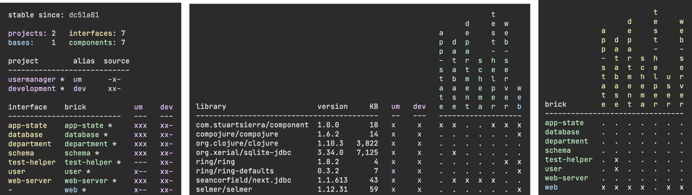

# Example Web Application in Clojure

This is a simple web application using [Component](https://github.com/stuartsierra/component), [Ring](https://github.com/ring-clojure/ring), [Compojure](https://github.com/weavejester/compojure), and [Selmer](https://github.com/yogthos/Selmer) connected to a local SQLite database.

On this branch, it is being migrated to the [Polylith](https://polylith.gitbook.io/) architecture:



Step 3 in progress:

* In preparation for adding more `components` as I refactor the code, switch back to the more standard `interface` naming convention from `api` which worked for the somewhat monolithic component identified in Step 2. So `usermanager.usermanager.interface` is the main component entry point and `usermanager.usermanager.model` implements that `interface`.
* Refactor out `app-state`, `database`, and `web-server` components.
* Refactor out `department` and `test-helper` components + renamed from `usermanager` to `user`.

Step 2:

* The application has now been split into `bases/web` and `components/usermanager`, namespaces have been updated to reflect the full split (`usermanager.web.main` and `usermanager.usermanager.api` are the two entry points; the old `usermanager.model.user-manager` is now `usermanager.usermanager.model` to implement the `api`).

Step 1 was:

* The entire application has been moved to `bases/web` without any renaming,
* `workspace.edn` has been added,
* A development `deps.edn` file has been added at the root,
* The application can be built in `projects/usermanager`,
* The application can be run in `:dev` mode,
* The tests can all be run via the `poly` tool.

The next step is to break the application apart into components and rename namespaces to follow their new structure.

> Note: my "Step 1" above is a combination of what the Polylith documentations refers to as steps 1 (create the empty workspace) and 2 (move the legacy app into a base) -- so "Step 2" above is Polylith's step 3, and "Step 3" onward is multiple iterations of Polylith's step 4. Nothing confusing about that, eh?

Clojure beginners often ask for a "complete" example that they can look at to see how these common libraries fit together and for a long time I pointed them at the User Manager example in the Framework One for Clojure repo -- but since I EOL'd that framework and I'd already rewritten the example app to no longer use the framework, it's just confusing to point them there, so this is a self-contained repo containing just that web app example.

A variant using [Integrant](https://github.com/weavejester/integrant) and [Reitit](https://github.com/metosin/reitit) (instead of Component and Compojure), inspired by this example repo, can be found in [Michaël Salihi's repo](https://github.com/PrestanceDesign/usermanager-reitit-integrant-example).

## Requirements

This example assumes that you have a recent version of the [Clojure CLI](https://clojure.org/guides/deps_and_cli) installed (at least 1.10.1.727), and provides a `deps.edn` file.

Clojure 1.10 (or later) is required. The "model" of this example app uses namespace-qualified keys in hash maps. It uses [next.jdbc](https://cljdoc.org/d/seancorfield/next.jdbc) -- the "next generation" JDBC library for Clojure -- which produces namespace-qualified hash maps from result sets.

## Usage

Clone the repo, `cd` into it, then follow below to _Run the Application_ or _Run the application in REPL_
or _Run the tests_.

### Run the Application
```
clojure -M:dev -m usermanager.main
```

It should create a SQLite database (`usermanager_db`) and populate two tables (`department` and `addressbook`) and start a Jetty instance on port 8080.

If that port is in use, start it on a different port. For example, port 8100:

```
clojure -M:dev -m usermanager.main 8100
```

### Run the Application in REPL

Start REPL

```
$ clj -M:dev
```

Once REPL starts, start the server as an example on port 8888:

```clj
user=> (require 'usermanager.main)                             ; load the code
user=> (in-ns 'usermanager.main)                               ; move to the namesapce
usermanager.main=> (def system (new-system 8888))              ; specify port
usermanager.main=> (alter-var-root #'system component/start)   ; start the server
```

### Run the tests

You can run all the tests via Polylith's `poly` tool:

```
clojure -M:poly test :all :dev
```

_Normally you would just use `clojure -M:poly test` to run tests that depend on code that has changed since your last commit._

## Stuff I Need To Do

* There should be some real-world tests.
* I might add a `datafy`/`nav` example.

# License & Copyright

Copyright (c) 2015-2021 Sean Corfield.

Distributed under the Apache Source License 2.0.
